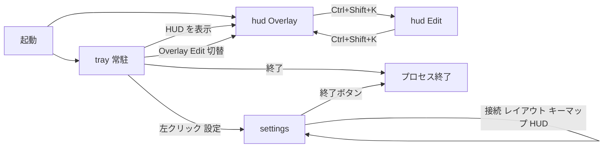

# KeyLayerHUD — 設計図（画面）

実装の詳細は [設計書.md](設計書.md)。見た目の正本はモック HTML。

## 画面一覧

| ID | 実体 | 正本モック |
|----|------|------------|
| `hud` | 透明オーバーレイ | `docs/mockup_hud.html` |
| `settings` | 設定（初期非表示） | `docs/mockup_settings.html` |
| `tray` | システムトレイ | ネイティブ（HTML なし） |

## 遷移

設定サイドバーは同一窓内パネル切替（ページ遷移ではない）。

- 接続: モード Mock/VIA/切断、VID/PID/Usage Page コピー、スキャン
- レイアウト: プロファイル選択（Phase A は corne-42 固定）
- キーマップ: サンプル / JSON インポート / ライブ dump（Phase B）
- HUD: ホットキー表示、Mock 自動切替、保存
- 終了: `quit_app`

## HUD 必須部品

- 接続徽章、Layer 徽章、左右キー、親指クラスタ
- Edit 時のみ: 不透明度、スケール、ピン、ドラッグ
- Overlay 時はヒットテスト無し（クリック透過）

## 未解決（実装時は設計書 §11 Phase B）

- 実機 HID 接続ループ
- レイアウト追加 UI
- ホットキーの設定値からの再登録（現状 `Ctrl+Shift+K` 固定）
