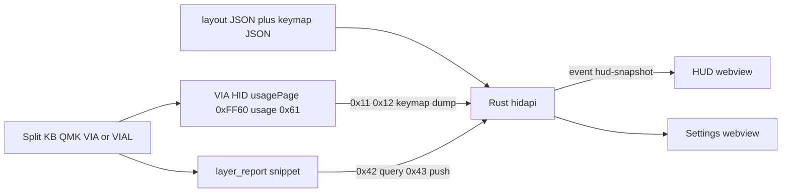
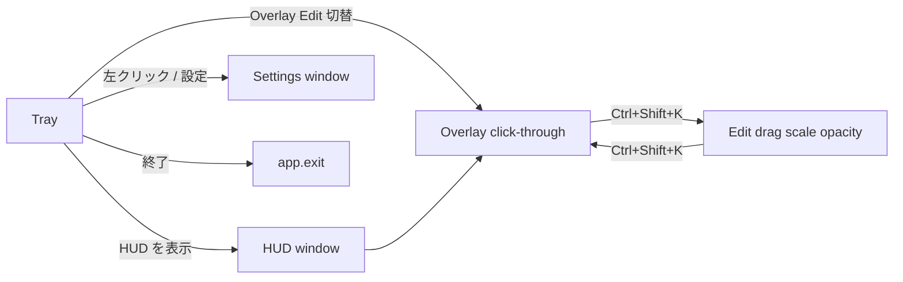

# KeyLayerHUD 設計書

他端末・別チャットで実装・改修するときの**正本**。画面見た目の正本はモック HTML、戻れない判断は ADR。README は利用者向け。

| 項目 | 値 |
|------|----|
| 製品名 | KeyLayerHUD |
| 版 | 0.1.0（Phase A 実装済み、Phase B 未完） |
| 保管 | `H:\CURSOR\KeyLayerHUD` |
| リポジトリ | [github.com/matrix9neonebuchadnezzar2199-sketch/KeyLayerHUD](https://github.com/matrix9neonebuchadnezzar2199-sketch/KeyLayerHUD)（Public, MIT） |
| デザインキット | **cyber**（ネイビー＋ネオン＋ガラス。トークンは `athena-cyber-intel/docs/mockup_redesign_cyber.html` と同系） |
| 識別子 | Tauri `com.keylayer.hud` |

作業開始時にこのファイルと ADR 3 件を読む。モック未承認のまま HUD 画面構成を変えない。

---

## 1. 目的

分割・自作キーボードの**現在アクティブなレイヤーとキーマップ**を、作業アプリの上に半透明で常時表示する。Win / macOS。学習期の「迷子」と、2D 作業時の手元確認コストを減らす。

VIA 標準プロトコルはキーマップ読取はできるが、**実行中レイヤーは取れない**。ライブ同期は QMK ファーム小片（Raw HID `0x42`/`0x43`）が本命。キーボード未着でも Mock で HUD を完成させる。

OS キーフックによるレイヤー推定は採用しない（設定二重管理と同期ズレ）。ZMK 無線単体（USB HID 無し）は MVP 対象外。アダプタ口だけ残す。

---

## 2. 他端末での着手手順

1. クローン: `git clone https://github.com/matrix9neonebuchadnezzar2199-sketch/KeyLayerHUD.git`
2. 本ファイルと `docs/adr/*.md` を読む
3. 画面変更なら `docs/mockup_hud.html` / `docs/mockup_settings.html` を先に直す
4. `npm install` → `python TEST.py` → `npm run tauri dev`
5. ブラウザ単体: `npm run dev` → `http://localhost:1420/hud.html?mock=1`

必要なランタイム: Node.js 20+、Rust stable（`rustup`）、Windows では WebView2（Win11 既定）。macOS は実機ビルド未検証。フルスクリーン別 Space への重なりは既知制限。

---

## 3. 確定制約（ADR）

| ID | 判断 |
|----|------|
| [ADR-001](adr/001-hid-exclusive.md) | HUD と VIA/VIAL GUI は Raw HID を同時独占できない。接続中は GUI を閉じる |
| [ADR-002](adr/002-layer-via-firmware.md) | ライブレイヤーは `firmware/qmk/layer_report.c`。VIA コマンド ID `0x01`〜`0x16` を奪わない |
| [ADR-003](adr/003-dual-window.md) | HUD 窓にサイドバーを置かない。必須装備（ライト/ダーク、フォント ±、幅可変サイドバー、コピー、ボタン色）は**設定窓**だけ |

---

## 4. アーキテクチャ



スタック: **Tauri 2 + Rust + Vite + TypeScript（React なし）**。常駐のためフロントは素の TS。hidapi は Rust のみ。VIA **書き込みコマンドは実装しない**（キーマップ破壊防止）。

キーマップ正本の優先順位:

1. VIA ライブ dump（Phase B）
2. インポート JSON
3. 同梱 `keymaps/sample-via.json`

レイヤー番号だけファーム報告で上書きする。

---

## 5. リポジトリ構成

```
KeyLayerHUD/
  docs/
    設計書.md              本ファイル
    設計図.md              画面と遷移
    mockup_hud.html
    mockup_settings.html
    adr/001-hid-exclusive.md
    adr/002-layer-via-firmware.md
    adr/003-dual-window.md
  firmware/qmk/            layer_report.c / .h / README.md
  layouts/corne-42.json
  keymaps/sample-via.json
  hud.html                 HUD 入口
  settings.html            設定入口
  src/                     Vite TS
    hud.ts / settings.ts / api.ts / types.ts
    styles/cyber.css / hud.css / settings.css
  src-tauri/src/
    lib.rs                 コマンド・トレイ・ホットキー
    hid.rs                 enumerate / VIA 読取
    via.rs                 プロトコル組み立て（書込なし）
    layer_report.rs        0x42 / 0x43
    keymap.rs              TRNS 解決・ラベル
    layout.rs              物理プロファイル
    persist.rs             settings.toml
    state.rs               HudSnapshot
  TEST.py                  cargo test + 必須ファイル存在
```

設定の永続化先（アプリデータ）:

- Windows: `%LOCALAPPDATA%\KeyLayerHUD\settings.toml`
- macOS: `~/Library/Application Support/KeyLayerHUD/settings.toml`

---

## 6. データモデル

### 6.1 `HudSnapshot`（Rust ↔ TS、イベント `hud-snapshot`）

`source` は snake_case: `mock` | `via_dump` | `layer_report` | `disconnected`

```json
{
  "source": "mock",
  "connected": true,
  "highest_layer": 1,
  "layer_mask": 2,
  "layer_name": "Nav",
  "layout_id": "corne-42",
  "layout_name": "Corne 42 (3x6 + 3 thumb x 2)",
  "labels": [{ "key_id": "L0R0C0", "text": "Tab", "code": 43, "momentary": false }],
  "keys": [{ "id": "L0R0C0", "half": "left", "row": 0, "col": 0, "x": 0, "y": 0, "thumb": false }],
  "hud_opacity": 0.88,
  "hud_scale": 1.0,
  "hud_pinned": false,
  "hud_edit_mode": false
}
```

### 6.2 レイアウト `layouts/<id>.json`

```json
{
  "id": "corne-42",
  "name": "Corne 42 (3x6 + 3 thumb x 2)",
  "matrix": { "rows": 4, "cols": 12 },
  "keys": [
    { "id": "L0R0C0", "half": "left", "row": 0, "col": 0, "x": 0, "y": 0 }
  ]
}
```

- `half`: `left` | `right`
- 親指クラスタは `row === 3` かつ `thumb: true`
- 行列は VIA バッファと同じ row-major。左 0–5 列、右 6–11 列（Corne 42 サンプル）
- 追加機種（Lily58 / Keyball）は **JSON 追加のみ**。Rust の描画ロジックを機種分岐しない

### 6.3 キーマップ `keymaps/*.json`

```json
{
  "layout_id": "corne-42",
  "layer_count": 4,
  "layer_names": ["Base", "Nav", "Sym", "Fn"],
  "matrix": { "rows": 4, "cols": 12 },
  "layers": [[[43, 20], [4, 16], [29, 27], [0, 41]]]
}
```

- `layers[layer][row][col]` は QMK 16bit キーコード
- `0x0000` = `KC_NO`（空白表示 `·`）
- `0x0001` = `KC_TRNS`（上位から下へ解決。解決不能なら `KC_NO`）
- 解決関数: `keymap::resolve_keycode(layers, row, col, up_to_layer)`
- モーメンタリー表示: `0x00F0..=0x00FF` および `0x5100..=0x51FF`

### 6.4 `AppSettings`（TOML）

| キー | 既定 | 意味 |
|------|------|------|
| `connection_mode` | `"mock"` | `mock` / `via` / `off` |
| `layout_id` | `"corne-42"` | `layouts/<id>.json` |
| `keymap_path` | `"keymaps/sample-via.json"` | 相対または絶対 |
| `hud_opacity` | `0.88` | 0.3–1.0 |
| `hud_scale` | `1.0` | 0.7–1.3 |
| `hud_pinned` | `false` | 位置固定の意図（永続フラグ） |
| `hud_edit_mode` | `false` | true ならクリック受信 |
| `mock_auto_cycle` | `true` | 3 秒周期でレイヤー巡回 |
| `mock_cycle_secs` | `3` | 表示用。実装の poll は 500ms × 6 tick |
| `hotkey` | `"Ctrl+Shift+K"` | 表示。登録は現状ハードコード `Ctrl+Shift+K` |
| `vid` / `pid` | `0` | 実機到着後に設定。ハードコード禁止 |

---

## 7. プロトコル

### 7.1 VIA（読取のみ）

HID: Usage Page `0xFF60`、Usage `0x61`。ホスト送信は 33 バイト（report ID `0x00` + コマンド + payload、残り 0）。

| コマンド | ID | 用途 |
|---------|-----|------|
| `GET_PROTOCOL_VERSION` | `0x01` | 応答 16bit。`< 8` なら layer count を 4 とみなす |
| `DYNAMIC_KEYMAP_GET_LAYER_COUNT` | `0x11` | プロトコル ≥ 8 |
| `DYNAMIC_KEYMAP_GET_BUFFER` | `0x12` | offset 16bit + size。1 回最大 28 バイト（14 keycodes） |

バッファ offset = `layer * rows * cols * 2`。ホストは `SET_*` / `BOOTLOADER` / EEPROM reset を送らない。

### 7.2 Layer report（カスタム）

32 バイト Raw HID。VIA の `0x01`–`0x16` と衝突しない。

| オフセット | 値 |
|------------|-----|
| 0 | `0x42` ホスト→KB クエリ / `0x43` KB→ホスト プッシュ |
| 1 | `get_highest_layer(layer_state)` |
| 2–5 | `layer_state` little-endian u32 |
| 6 | `get_mods()` |

ファーム: `firmware/qmk/`。`RAW_ENABLE = yes`。VIAL は `raw_hid_receive_kb` から `klh_raw_hid_receive` を呼ぶ。VIA 専用機で `raw_hid_receive` が VIA に占有されている場合は custom value `0x08` を検討（コマンド ID は奪わない）。

Poll 間隔の目安: 50–100ms（現状のバックグラウンドスレッドは Mock 巡回のみ。**Phase B で VIA dump と layer_report の実接続ループを足す**）。

---

## 8. ウィンドウとモード



### HUD 窓（label `hud`）

- 枠なし・透明・alwaysOnTop・skipTaskbar・初期 760×300
- Overlay: `set_ignore_cursor_events(true)`。背面アプリへクリックを通す
- Edit: クリック受信、ドラッグ移動、不透明度・スケール。破線アウトライン
- 描画: 左右ハーフ＋親指。ラベルは snapshot の `labels` を `key_id` で結ぶ
- サイドバー禁止。接続徽章（Mock / VIA / Live / Off）と Layer 徽章のみ
- 見た目正本: `docs/mockup_hud.html`

### 設定窓（label `settings`）

- 通常枠、初期非表示。トレイまたは左クリックで表示
- サイドバー: 接続 / レイアウト / キーマップ / HUD / 終了
- 必須装備: ☀🌙、フォント ±、ドラッグ幅、境界の ▼ 折りたたみ、左端吹き出し復帰、接続値の 📋、ボタン色（基本青 / 保存緑 / 終了赤）
- 見た目正本: `docs/mockup_settings.html`

### トレイ

| ID | ラベル |
|----|--------|
| `show_hud` | HUD を表示 |
| `settings` | 設定… |
| `toggle_mode` | Overlay / Edit 切替 |
| `quit` | 終了 |

HUD を閉じてもトレイは残る。**完全終了はトレイ「終了」または設定の終了ボタン**（`quit_app` → `app.exit(0)`）。

ホットキー: `Ctrl+Shift+K` → `toggle_overlay_edit`。

---

## 9. Tauri コマンド

フロントは `@tauri-apps/api` の `invoke`。ブラウザ `?mock=1` または `__TAURI_INTERNALS__` 無しでは `src/api.ts` がローカル Mock にフォールバックする。

| コマンド | 引数 | 戻り |
|---------|------|------|
| `get_snapshot` | — | `HudSnapshot` |
| `get_settings` | — | `AppSettings` |
| `save_app_settings` | `settings` | `()` |
| `set_connection_mode` | `mode: string` | `HudSnapshot` |
| `set_mock_layer` | `layer: u8` | `HudSnapshot` |
| `set_hud_edit_mode` | `editMode: bool` | `()` |
| `set_hud_visual` | `opacity, scale, pinned` | `HudSnapshot` |
| `toggle_overlay_edit` | — | `bool`（新しい edit 状態） |
| `show_settings` / `show_hud` / `hide_hud` | — | `()` |
| `quit_app` | — | `()` |
| `list_hid_devices` | — | `(path, vid, pid)[]` |
| `import_keymap_json` | `path` | `HudSnapshot` |
| `get_resource_info` | — | `{ project_root, usage_page, layer_cmd }` |

状態変更後は必ず `emit("hud-snapshot", snapshot)`。

capabilities: `src-tauri/capabilities/default.json` の `windows` は `["hud", "settings"]`。`set_ignore_cursor_events` と global-shortcut / dialog / tray を許可済み。

フロント複数入口は `vite.config.ts` の `rollupOptions.input`（`hud.html`, `settings.html`）。トップレベル await は使わない（WebView ターゲット制約）。

---

## 10. UI トークン（cyber）

CSS 変数（ダーク既定）。ライトは `:root.light`。

- `--bg: #0a0e27`
- `--link: #00d4ff` / `--purple: #8b5cf6`
- `--btn: #0ea5c6` / `--btn-save: #10b981` / `--btn-stop: #ff0055` / `--btn-warn: #e3892b`
- 本文 Inter、キーラベル JetBrains Mono
- カード `border-radius: 16px`、ボタン `8px`、ガラス `backdrop-filter: blur(12px)`

ブラウザ通知 API は使わない（全ツール方針）。状態は画面内徽章のみ。

---

## 11. 実装フェーズ

### Phase A（完了）

- 二窓 Tauri、トレイ、ホットキー、Overlay/Edit
- Corne 42 + サンプル 4 レイヤー、TRNS 解決、Mock 巡回
- VIA 読取コードとファーム小片（ユニットテストあり。実機ループ未配線）
- `?mock=1` ブラウザプレビュー

### Phase B（実機到着後）

1. `connection_mode == "via"` で HID を開き、失敗を設定 UI に出す（占有エラー含む）
2. `ViaDevice::read_layer_matrix` でキーマップ dump → runtime.keymap
3. 80ms 前後で `query_layer_report` または unsolicited `0x43` を読み、`apply_layer_report`
4. 切断再接続。VID/PID は設定から。ゼロなら enumerate の先頭 VIA 面
5. レイアウト JSON 追加（Lily58 等）

### 入れない

キー押下ハイライト、マクロ展開、VIA 書き込み、ZMK BLE、OS 全体キーログ、Electron。

---

## 12. 検証

```powershell
cd KeyLayerHUD
python TEST.py
npm run build
npm run tauri dev
```

必須:

- `cargo test`: VIA バッファ、TRNS 解決、`0x43` パース
- Mock でレイヤータブを押すとラベルが変わる
- Overlay 中、HUD 上のクリックが背面アプリに届く
- トレイ終了後、プロセスが残らない
- macOS はフラグ確認のみ可。別 Space フルスクリーンは README に既知制限として残す

`TEST.py` が存在確認するパス: `layouts/corne-42.json`, `keymaps/sample-via.json`, `firmware/qmk/layer_report.c`, `docs/mockup_hud.html`, `docs/mockup_settings.html`, `hud.html`, `settings.html`。

---

## 13. 他端末がやってはいけないこと

- Electron への載せ替え、HUD へのサイドバー追加
- VIA `SET` / bootloader / EEPROM コマンドの実装
- 実 VID/PID・顧客機種名のハードコード
- モックと実装で画面構成を黙ってずらす
- OS キーフックでレイヤーを推測する「簡単実装」

---

## 14. 関連

- 画面遷移の要約: [設計図.md](設計図.md)
- ファーム手順: [firmware/qmk/README.md](../firmware/qmk/README.md)
- 利用者手順: [README.md](../README.md)
